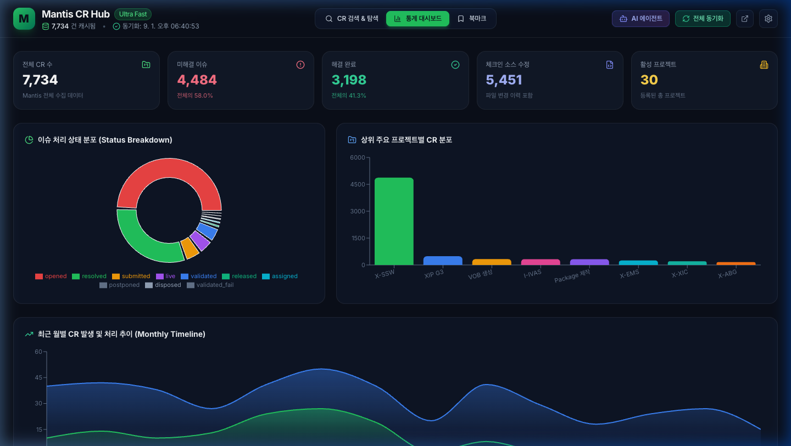
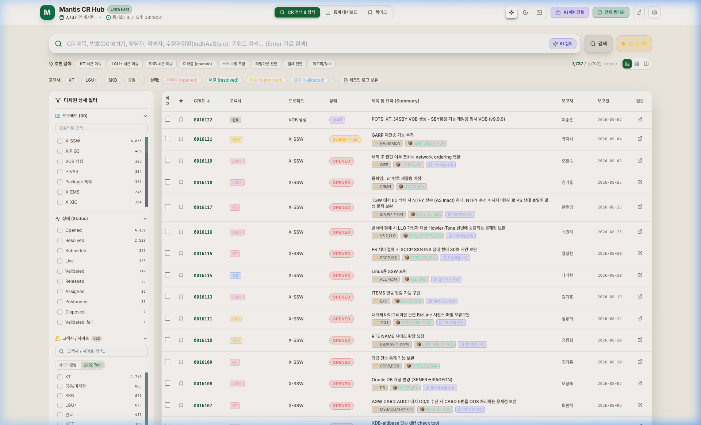
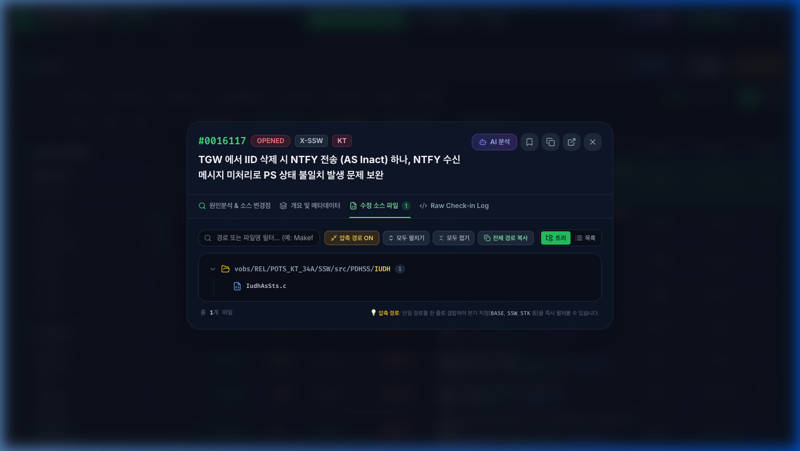
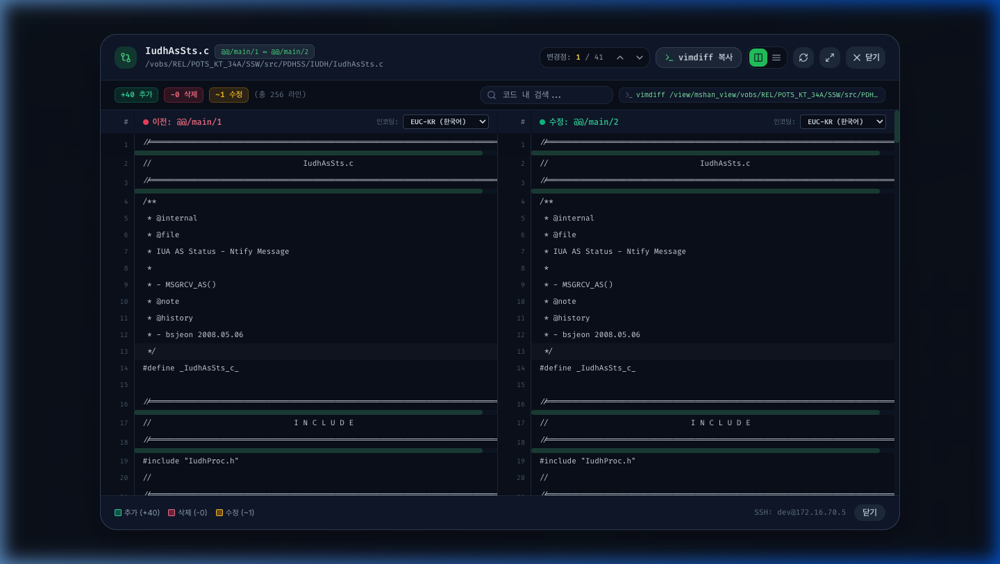
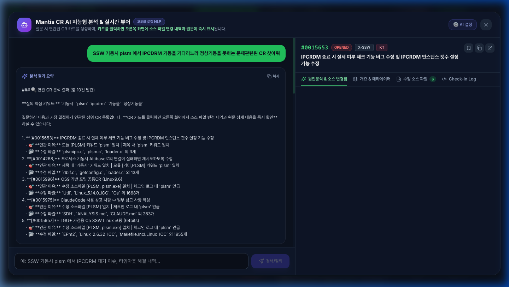

# ⚡ Mantis CR Ultra Search & AI Hub

<p align="center">
  
  
  
  
  
</p>

<p align="center">
  <strong>사내 Mantis CR 시스템(7,700+건)의 초고속 검색, 통계 대시보드, AI 버그 분석, 그리고 터미널 없이 브라우저에서 바로 소스 코드를 비교하는 ClearCase 실시간 Web vimdiff 올인원 플랫폼</strong>
</p>

---

## 📸 주요 화면 갤러리 (Key Screenshots)

### 1. 📊 통합 통계 분석 대시보드 (Analytics Dashboard)
> 프로젝트별, 월별 발생 추이, 처리 상태 현황(도넛 차트), 최다 수정 파일 순위를 한눈에 실시간 모니터링합니다.



---

### 2. ⚡ 초고속 실시간 복합 검색 허브 (Ultra Search Hub)
> 7,700건 이상의 대용량 CR 데이터베이스를 **0.05초** 만에 고객사(`KT`, `SKB`, `LGU+`), 프로젝트(`SSW`, `POTS`, `BASE`), 상태별로 정밀 필터링합니다.



---

### 3. 📁 CR 상세 정보 & 수정 소스 폴더 트리 뷰어 (CR Detail & Folder Tree)
> CR의 문제 요약, 상세 원인, 해결 방안, 블록 내역을 확인하고, 수정된 전체 소스 파일 목록을 계층형 압축 트리(Folder Tree)로 편리하게 탐색합니다.



---

### 4. 🔀 ClearCase 실시간 Web vimdiff & 한글 인코딩 변환기 (Web Diff Viewer)
> 원격 ClearCase 서버의 이전 버전(`@@/main/N-1`)과 수정 버전(`@@/main/N`)을 실시간으로 가져와 **수백~수천 줄의 원본 소스를 Side-by-Side로 정렬 및 단어 단위 변경점(Token Diff)**을 비교합니다.  
> 좌/우 화면별로 **EUC-KR, CP949, UTF-8** 인코딩을 실시간 선택하여 한글 주석 깨짐 없이 즉시 확인할 수 있습니다.



---

### 5. 🤖 AI 에이전트 버그 원인 분석 및 유사 CR 탐색 (AI Agent Hub)
> 자연어 검색을 통해 유사한 과거 장애/수정 이력을 빠르게 찾고, 문제 원인 및 패치 가이드를 제공합니다.



---

## ✨ 핵심 기능 요약 (Key Features)

| 기능 | 설명 |
| :--- | :--- |
| **🚀 ClearCase 실시간 Web vimdiff** | 터미널 SSH에 접속하여 일일이 `vimdiff` 명령을 입력할 필요 없이, 브라우저에서 **`[⚡ Diff]`** 버튼 하나로 이전 버전과 현재 버전의 소스 코드 변경점을 직관적인 Side-by-Side 테이블로 즉시 비교 |
| **🔤 무손실 한글 인코딩 실시간 스위처** | 레거시 교환기/통신 C/C++ 소스 및 스크립트의 **EUC-KR (한국어 기본)**, **CP949**, **UTF-8**, **ISO-8859-1** 인코딩을 좌/우 독립 드롭다운으로 0ms 즉각 전환 |
| **🛡️ 엔터프라이즈급 SSH 세션 안전 관리** | 요청 시점에만 안전하게 통신하고 완료 즉시 소켓을 완전 파괴(`conn.destroy()`)하여 서버 측 좀비 프로세스 및 SSH 동시 접속 한도 초과(`MaxStartups`)를 100% 방지 |
| **📦 7,700+건 독립 휴대용 포터블 DB** | 원격 Mantis 서버에 부하를 주지 않고, 로컬 메모리/파일 기반 초고속 검색 및 증분 동기화(Incremental Upsert) 지원 |
| **🧭 스마트 경로 정규화 & Auto-Locator** | 체크인 로그로부터 VOB 절대 경로를 자동 추적하고, 경로 차이가 있더라도 백그라운드에서 파일 위치를 자동 탐색 |
| **📊 인터랙티브 비주얼 분석 대시보드** | Recharts 기반 월별 유입량, 고객사별 점유율, 상태별 도넛 차트 제공 |

---

## 💻 설치 및 실행 방법 (Quick Start Guide)

### 🍎 macOS 환경 (추천: 전용 설치형 DMG 또는 스크립트)

#### 방법 1: macOS 전용 설치형 DMG 파일로 설치 (가장 간편)
1. [GitHub Releases](https://github.com/HyungdukSeo/E-sim/releases)에서 **`Mantis CR Ultra Hub-1.0.0-arm64.dmg`** 를 다운로드합니다.
2. 다운로드한 `.dmg` 파일을 열고 **`Mantis CR Ultra Hub`** 아이콘을 **`Applications`** 폴더로 드래그하여 설치합니다.
3. 실행하면 상단 **메뉴바(시스템 트레이)에 번개 아이콘이 상주**하며 백그라운드로 작동합니다.
   * **트레이 아이콘 클릭 메뉴**:
     * 🌐 **Mantis CR Hub 열기** (전용 데스크톱 창 또는 브라우저 실행)
     * 🔄 **Mantis 최신 데이터 즉시 동기화 / 업데이트** (원격 7,700건 원클릭 갱신)
     * 🟢 **서버 상태 실시간 모니터링 (Port 3001)**
     * ⚙️ **ClearCase SSH 설정 열기**
     * 🚪 **완전 종료**

#### 방법 2: 터미널 스크립트로 실행
1. 저장소를 클론합니다:
   ```bash
   git clone https://github.com/HyungdukSeo/E-sim.git
   cd E-sim
   ```
2. 시작 스크립트를 실행합니다:
   ```bash
   chmod +x start.sh stop.sh
   ./start.sh
   ```
3. 브라우저에서 **`http://localhost:5173`** 또는 **`http://localhost:3001`** 에 접속합니다.
4. 서비스 종료 시:
   ```bash
   ./stop.sh
   ```

---

### 🪟 Windows 환경

1. [GitHub Releases](https://github.com/HyungdukSeo/E-sim/releases) 또는 저장소에서 프로젝트를 다운로드합니다.
2. 폴더 내의 **`start.bat`** 파일을 **더블 클릭**합니다.
   * Node.js가 설치되어 있다면 필요한 모듈을 자동 구성하고 로컬 서버를 즉시 시작합니다.
   * 브라우저(`http://localhost:3001`)가 자동으로 실행됩니다.
3. 서비스 종료 시에는 **`stop.bat`**을 더블 클릭하거나 실행 창을 닫으시면 됩니다.

```cmd
:: 수동 실행 시 (Windows CMD / PowerShell)
cd E-sim
start.bat
```

---

## ⚙️ ClearCase SSH 서버 연동 설정

웹 화면 우측 상단의 **`[⚙️ 설정]`** 아이콘을 클릭하여 SSH 접속 정보를 입력합니다:

* **서버 IP**: `172.16.70.5`
* **포트**: `22`
* **계정(Username)**: `dev`
* **비밀번호**: *(서버 접속 비밀번호)*
* **기본 View 태그**: `hyungduk_view` *(자동 감지 지원)*

> **`[연결 테스트]`** 버튼을 눌러 성공 메시지가 확인되면 설정이 로컬에 안전하게 저장됩니다.

---

## 🏗️ 기술 스택 (Tech Stack)

* **Frontend**: React 18, TypeScript, Tailwind CSS, Lucide Icons, Recharts, Diff (LCS diff algorithm)
* **Backend**: Node.js, Express, `ssh2`, `iconv-lite`, `compression`, `csv-parse`
* **Build Tool**: Vite 6, TypeScript Compiler (`tsc`)
* **Version Control / SCMS**: Rational ClearCase Dynamic MVFS, Mantis BT

---

## 📄 라이선스 (License)

본 프로젝트는 사내 Mantis CR 분석 및 ClearCase 형상관리 생산성 혁신을 위해 제작되었습니다.  
Copyright © 2026 Mantis CR Ultra Hub Team. All rights reserved.
