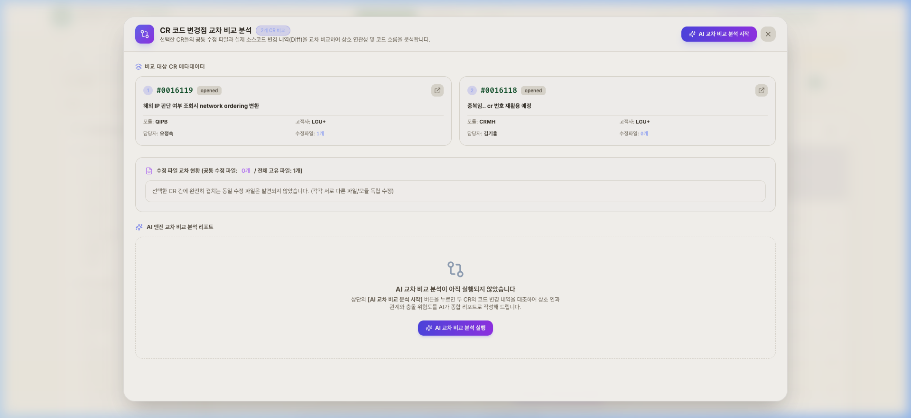
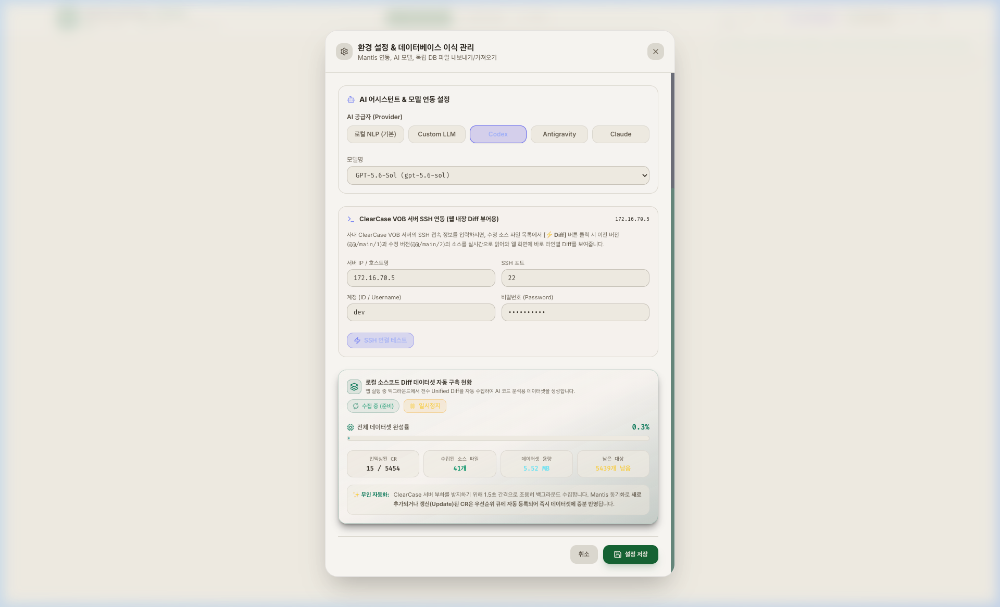
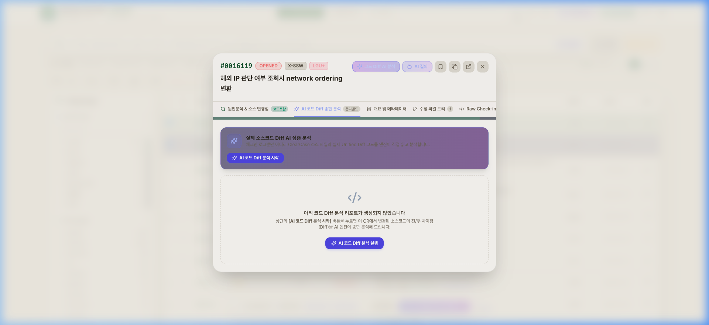
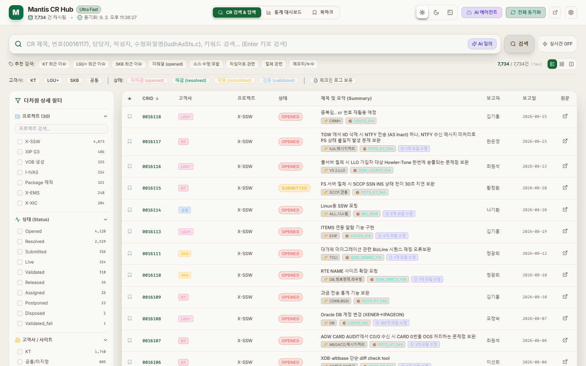
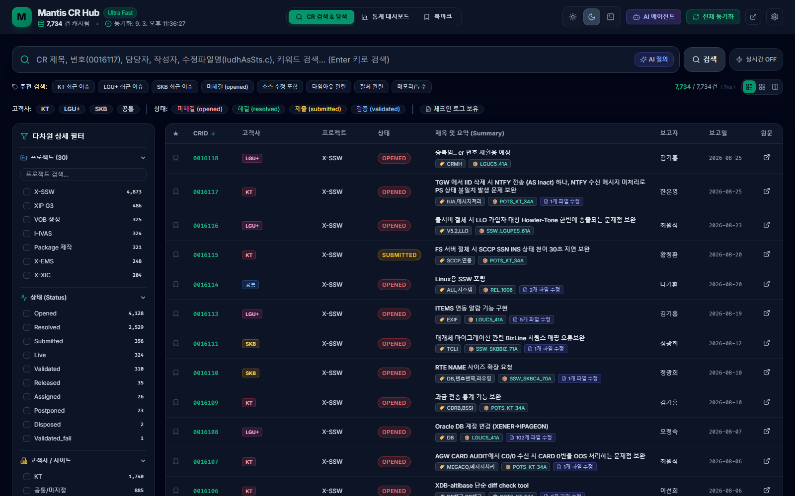
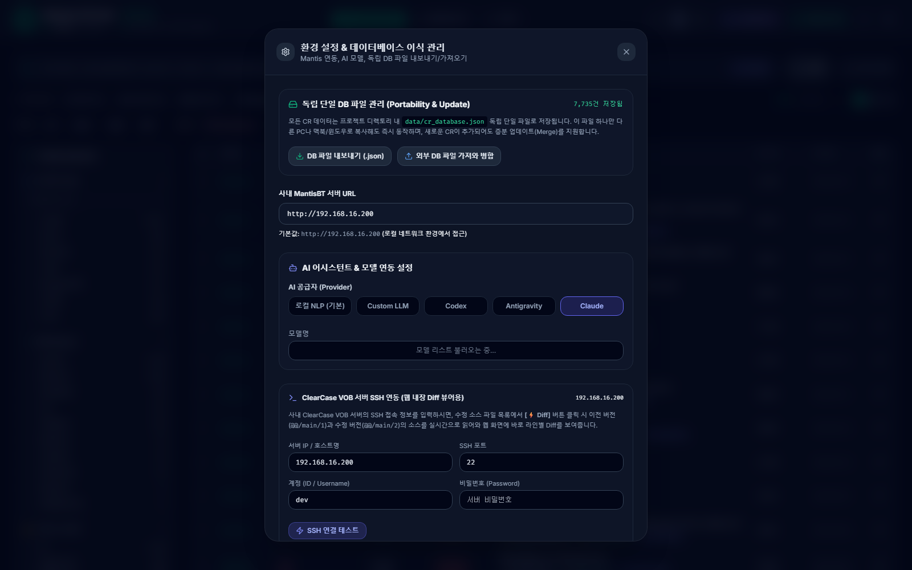

# ⚡ Mantis CR Ultra Search & AI Hub

<p align="center">
  
  
  
  
  
  
  
  
</p>

<p align="center">
  <strong>사내 Mantis CR 시스템(7,700+건)의 초고속 검색, 통계 대시보드, ClearCase 실시간 Web vimdiff, 백그라운드 소스코드 Diff 데이터셋 무인 자동 구축, 복수 CR 코드 변경점 교차 비교 분석을 지원하는 올인원 엔지니어링 플랫폼</strong>
</p>

---

## 📸 주요 화면 갤러리 (Key Screenshots)

### 1. 📊 통합 통계 분석 대시보드 (Analytics Dashboard)
> 프로젝트별, 월별 발생 추이, 처리 상태 현황(도넛 차트), 최다 수정 파일 순위를 한눈에 실시간 모니터링합니다.


---

### 2. ⚡ 초고속 실시간 복합 검색 허브 & 고객사/사이트 스마트 아코디언 (Ultra Search Hub)
> 7,700건 이상의 대용량 CR을 **0.05초** 만에 검색합니다. **625개 고객사/사이트**를 전용 실시간 검색창, 자모/알파벳 초성별 아코디언 접기/펼치기, 퀵 점프 칩(`A~Z`, `ㄱ~ㅎ`), 상위 핵심 고객사를 한눈에 보는 `인기순 Top 20` 탭으로 쾌적하게 필터링합니다.


---

### 3. 🔍 복수 CR 코드 변경점 교차 비교 분석 (Cross CR Comparison)
> 검색 결과 테이블에서 2~3개의 CR을 체크박스로 선택 후 **`[⚡ 코드 변경점 교차 비교 분석]`**을 클릭하면, 각 CR의 수정 소스 파일 Diff를 대조하여 공통 수정 파일 및 코드 변경 흐름을 AI 엔진이 비교표와 함께 심층 분석합니다.



---

### 4. ⚙️ 로컬 소스코드 Diff 데이터셋 무인 자동 구축 현황 (Background Diff Indexer)
> 앱이 실행되어 있는 동안 ClearCase 서버에 부하를 주지 않도록 **1.5초 안전 쿨다운(Throttle)**을 두고 백그라운드에서 전수 Unified Diff를 자동 수집합니다. Mantis 동기화 시 새로 추가되거나 갱신된 CR은 우선순위 큐(Priority Queue)에 자동 등록되어 즉시 증분 반영됩니다. 환경설정 창에서 **실시간 완성률(%) 프로그레스 바**와 상세 통계를 확인하고 일시정지/재개할 수 있습니다.



---

### 5. 📁 CR 상세 정보 & 🤖 AI 코드 Diff 종합 분석 (CR Detail & AI Analysis)
> CR의 문제 요약, 상세 원인, 해결 방안, 계층형 압축 폴더 트리(Folder Tree)뿐만 아니라, **`[🤖 AI 코드 Diff 종합 분석]`** 탭에서 해당 CR의 핵심 소스 변경점을 AI가 전문 엔지니어 관점에서 요약·해설합니다.



---

### 6. 🔀 ClearCase 실시간 Web vimdiff & 한글 인코딩 변환기 (Web Diff Viewer)
> 원격 ClearCase 서버의 이전 버전(`@@/main/N-1`)과 수정 버전(`@@/main/N`)을 실시간으로 가져와 **수백~수천 줄의 원본 소스를 Side-by-Side로 정렬 및 단어 단위 변경점(Token Diff)**을 비교합니다.  
> 좌/우 화면별로 **EUC-KR, CP949, UTF-8** 인코딩을 실시간 선택하여 한글 주석 깨짐 없이 즉시 확인할 수 있습니다.


---

### 7. 🤖 AI 에이전트 버그 원인 분석 및 유사 CR 탐색 (AI Agent Hub)
> 자연어 검색을 통해 유사한 과거 장애/수정 이력을 빠르게 찾고, 문제 원인 및 패치 가이드를 제공합니다.


---

### 8. 🌗 라이트 / 다크 테마 스위처 (Theme Switcher)
> 헤더 우측의 토글로 라이트/다크/개발자 테마를 즉시 전환합니다. 다크 모드는 눈의 피로를 줄이는 딥 에메랄드·포레스트 그린 톤으로 가독성을 개선했습니다.

| 라이트 테마 | 다크 테마 |
| :---: | :---: |
|  |  |

---

### 9. 🧠 멀티 AI 공급자 & OmniRoute 로컬 게이트웨이 연동 (Multi AI Provider Settings)
> 로컬 NLP, **OmniRoute(로컬 AI Gateway)**, Custom LLM, Codex, Antigravity, **Claude(Anthropic)**를 지원합니다. 특히 오픈소스 로컬 AI 게이트웨이 [OmniRoute](https://github.com/diegosouzapw/OmniRoute)와의 원클릭 연동으로 Claude, OpenAI, Gemini, Ollama 등의 공급자를 로컬 포트(20128)에서 스마트 분기(`auto`, `auto/coding`, `auto/fast`, `auto/cheap`) 처리할 수 있습니다.



---

## ✨ 핵심 기능 요약 (Key Features)

| 기능 | 설명 |
| :--- | :--- |
| **🤖 로컬 Diff 데이터셋 무인 자동 구축** | 앱이 실행되어 있는 동안 1.5초 안전 간격으로 ClearCase 서버 부하 없이 백그라운드 전수 수집. Mantis 동기화 시 갱신/신규 CR 우선순위 큐(Priority Queue) 자동 증분 반영 |
| **📊 데이터셋 실시간 완성률(%) 모니터링** | 환경설정 창에서 실시간 프로그레스 바(0~100%), 인덱싱된 CR/파일 수/디스크 용량(MB) 실시간 집계 및 원클릭 일시정지/재개 토글 제공 |
| **🔀 복수 CR 코드 변경점 교차 비교** | 검색 테이블에서 2~3개 CR 선택 후 `[⚡ 코드 변경점 교차 비교 분석]` 원클릭 실행. 공통 수정 파일 및 변경 흐름 AI 종합 비교 보고서 제공 |
| **🏢 고객사/사이트(625개) 스마트 필터** | 전용 실시간 검색창, 알파벳(A~Z) & 한글 초성(ㄱ~ㅎ)별 접기/펼치기 아코디언 그룹, 퀵 점프 칩 바, 상위 20대 `인기순 Top` 탭 및 선택 뱃지 모아보기 지원 |
| **🚀 ClearCase 실시간 Web vimdiff** | 터미널 SSH에 접속하여 일일이 `vimdiff` 명령을 입력할 필요 없이, 브라우저에서 **`[⚡ Diff]`** 버튼 하나로 이전 버전과 현재 버전의 소스 코드 변경점을 직관적인 Side-by-Side 테이블로 즉시 비교 |
| **🔤 무손실 한글 인코딩 실시간 스위처** | 레거시 교환기/통신 C/C++ 소스 및 스크립트의 **EUC-KR (한국어 기본)**, **CP949**, **UTF-8**, **ISO-8859-1** 인코딩을 좌/우 독립 드롭다운으로 0ms 즉각 전환 |
| **🛡️ 엔터프라이즈급 SSH 세션 안전 관리** | 요청 시점에만 안전하게 통신하고 완료 즉시 소켓을 완전 파괴(`conn.destroy()`)하여 서버 측 좀비 프로세스 및 SSH 동시 접속 한도 초과(`MaxStartups`)를 100% 방지 |
| **📦 7,700+건 독립 휴대용 포터블 DB** | 원격 Mantis 서버에 부하를 주지 않고, 로컬 메모리/파일 기반 초고속 검색 및 증분 동기화(Incremental Upsert) 지원 |
| **🧭 스마트 경로 정규화 & Auto-Locator** | 체크인 로그로부터 VOB 절대 경로를 자동 추적하고, 경로 차이가 있더라도 백그라운드에서 파일 위치를 자동 탐색 |
| **📦 DB & Diff 캐시 통합 ZIP 백업/복원** | `cr_database.json` 메타데이터뿐만 아니라 1.38GB 분량의 소스코드 Diff 캐시 전수(5,454건)를 약 250MB 단일 ZIP 번들로 고속 압축 내보내기/가져오기 지원. 다른 PC에 전달 시 SSH 추가 수집 없이 100% 즉시 사용 |
| **📊 인터랙티브 비주얼 분석 대시보드** | Recharts 기반 월별 유입량, 고객사별 점유율, 상태별 도넛 차트 제공 |
| **✅ 다차원 상세 필터 (교차 선택)** | 프로젝트/상태/고객사/보고자/담당자를 다중 체크박스로 자유롭게 조합, 다른 항목을 체크해도 형제 옵션은 사라지지 않고 카운트만 실시간으로 좁혀짐 |
| **🌗 라이트 / 다크 / 개발자 테마** | 헤더에서 즉시 전환 가능한 3종 테마, 라이트 모드 고대비(High Contrast) 가독성 및 딥 에메랄드 다크 톤 지원 |
| **🧠 멀티 AI 공급자 (OmniRoute / Claude 포함)** | 로컬 NLP / **OmniRoute Gateway** / Custom LLM / Codex / Antigravity / **Claude** 중 선택, SQLite 기반 토큰 자동 감지 및 실시간 모델 목록 연동 |
| **💾 설정 디스크 영구 저장** | 환경설정(`data/settings.json`)이 로컬 디스크에 저장되어 앱 재시작 후에도 SSH/AI 설정이 유지됨 |

---

## 💻 설치 및 실행 방법 (Quick Start Guide)

### 🍎 macOS 환경 (추천: 전용 설치형 DMG 또는 스크립트)

#### 방법 1: macOS 전용 설치형 DMG 파일로 설치 (가장 간편)
1. [GitHub Releases](https://github.com/HyungdukSeo/E-sim/releases)에서 **`Mantis CR Ultra Hub-1.0.2-arm64.dmg`** 를 다운로드합니다.
2. 다운로드한 `.dmg` 파일을 열고 **`Mantis CR Ultra Hub`** 아이콘을 **`Applications`** 폴더로 드래그하여 설치합니다.
3. 실행하면 상단 **메뉴바(시스템 트레이)에 번개 아이콘이 상주**하며 백그라운드로 작동합니다.
   * **트레이 아이콘 클릭 메뉴**:
     * 🌐 **Mantis CR Hub 열기** (전용 데스크톱 창 또는 브라우저 실행)
     * 🔄 **Mantis 최신 데이터 즉시 동기화 / 업데이트** (원격 7,700건 원클릭 갱신)
     * 🟢 **서버 상태 실시간 모니터링 (Port 3001)**
     * ⚙️ **ClearCase SSH 설정 열기**
     * 🚪 **완전 종료**

#### 방법 2: 터미널 스크립트로 실행
1. 저장소를 클론합니다:
   ```bash
   git clone https://github.com/HyungdukSeo/E-sim.git
   cd E-sim
   ```
2. 시작 스크립트를 실행합니다:
   ```bash
   chmod +x start.sh stop.sh
   ./start.sh
   ```
3. 브라우저에서 **`http://localhost:5173`** 또는 **`http://localhost:3001`** 에 접속합니다.
4. 서비스 종료 시:
   ```bash
   ./stop.sh
   ```

#### 방법 3: 소스에서 직접 macOS DMG 빌드

> [!IMPORTANT]
> **전제 조건**: `data/cr_database.json` 파일이 반드시 있어야 합니다.  
> 이 파일은 234MB로 GitHub에 올라가 있지 않으므로, **기존 설치된 앱에서 DB를 복사**하거나 앱을 먼저 실행하여 동기화해야 합니다.

```bash
# 1. 저장소 클론
git clone https://github.com/HyungdukSeo/E-sim.git
cd E-sim

# 2. 의존성 설치
npm install

# 3. data/cr_database.json 준비 (아래 두 방법 중 하나)
#    방법 A: 기존 설치된 앱의 DB 파일 복사
#    cp ~/Library/Application\ Support/Mantis\ CR\ Ultra\ Hub/data/cr_database.json data/
#    방법 B: 앱을 먼저 실행하여 Mantis 서버와 동기화 후 복사

# 4. macOS DMG 빌드 (DB 파일 존재 여부를 자동 검증)
npm run dist:mac
```

---

### 🪟 Windows 환경

1. [GitHub Releases](https://github.com/HyungdukSeo/E-sim/releases) 또는 저장소에서 프로젝트를 다운로드합니다.
2. 폴더 내의 **`start.bat`** 파일을 **더블 클릭**합니다.
   * Node.js가 설치되어 있다면 필요한 모듈을 자동 구성하고 로컬 서버를 즉시 시작합니다.
   * 브라우저(`http://localhost:3001`)가 자동으로 실행됩니다.
3. 서비스 종료 시에는 **`stop.bat`**을 더블 클릭하거나 실행 창을 닫으시면 됩니다.

```cmd
:: 수동 실행 시 (Windows CMD / PowerShell)
cd E-sim
start.bat
```

---

## ⚙️ ClearCase SSH 서버 연동 설정

웹 화면 우측 상단의 **`[⚙️ 설정]`** 아이콘을 클릭하여 SSH 접속 정보를 입력합니다:

* **서버 IP**: `172.16.70.5`
* **포트**: `22`
* **계정(Username)**: `dev`
* **비밀번호**: *(서버 접속 비밀번호)*
* **기본 View 태그**: `hyungduk_view` *(자동 감지 지원)*

> **`[연결 테스트]`** 버튼을 눌러 성공 메시지가 확인되면 설정이 로컬에 안전하게 저장됩니다.

---

## 🏗️ 기술 스택 (Tech Stack)

* **Frontend**: React 18, TypeScript, Tailwind CSS, Lucide Icons, Recharts, Diff (LCS diff algorithm)
* **Backend**: Node.js, Express, `ssh2`, `iconv-lite`, `compression`, `csv-parse`
* **Build Tool**: Vite 6, TypeScript Compiler (`tsc`)
* **Version Control / SCMS**: Rational ClearCase Dynamic MVFS, Mantis BT

---

## 📝 변경 이력 (Changelog)

### v1.0.2
* 📦 **전체 DB & Diff 캐시 통합 ZIP 백업/복원 (`DB&Cache 내보내기`)**:
  * Mantis CR 메타데이터 DB와 1.38GB 분량의 소스코드 Diff 캐시 전수(5,454건)를 약 250MB 단일 ZIP 번들로 고속 압축 내보내기 및 스트리밍 가져오기 지원
  * 다른 PC의 `데이터 저장 폴더 열기`에 직접 압축을 풀거나 `외부 DB&Cache 가져오기`로 업로드하면, ClearCase SSH 추가 수집 없이 즉시 100% 동일하게 구동
* 🤖 **OmniRoute / Claude 등 멀티 AI 안정성 강화 & Null-Byte 오류 완전 해결**:
  * 바이너리 파일(`.so`, `.a`, `.o`, `.bin` 등) 및 널 바이트(`\0`)가 포함된 Diff 데이터를 자동으로 감지·정제(Sanitize)하여 `child_process.spawn` 오류로 인한 로컬 모드 자동전환 현상 원천 해결
  * Claude CLI 바이너리 절대 경로 우선 탐색 및 CLI 실패 시 로컬 토큰(`~/.claude/.credentials.json`, Keychain)을 통한 Anthropic REST API 2차 자동 복구 지원
  * 대용량 소스코드 Diff 분석을 위한 AI 엔진 타임아웃 180초 확장
* 🤖 **OmniRoute 토큰 자동 감지 및 401 자동 복구 Fallback**:
  * 로컬 SQLite(`~/.omniroute/storage.sqlite`)에서 API 키 자동 추출
  * `CHANGEME`, `sk-omniroute` 등 플레이스홀더 키 자동 정화 및 401 인증 실패 시 로컬 토큰으로 자동 재시도 복구 탑재
* 🎨 **라이트 모드 고대비(High Contrast) UI 전면 개선**:
  * 라이트 테마(베이지/페이퍼)에서 미선택 버튼 텍스트가 배경에 묻히던 현상 해결 (`text-neutral-900` 딥 블랙 및 볼드 적용)
  * `OmniRoute`, `Antigravity` 등 긴 라벨 텍스트의 말줄임(`truncate`) 현상 방지 및 인덱싱 통계 카드 명도 강화
* 🎯 **Diff 데이터셋 인덱싱 분자/분모 정밀화 및 Update 트리거 개선**:
  * 5,454개 유효 대상 CR 기준 캐시 수를 정확히 매핑하여 `5454 / 5454 (100%)`로 일치
  * Mantis 동기화 시 신규 추가/수정된 CR이 있을 때만 diff 수집 큐에 등록하여, 변경사항 없는 일반 Update 시 100% 완료 상태 유지
* 🌐 **ClearCase VOB 서버 다중 연동 & 지능형 자동 폴백(Fallback)**: 복수 ClearCase 서버 등록 지원, 1차 서버에 VOB/소스가 없을 경우 2차/3차 서버를 백그라운드에서 순차 자동 탐색하여 Diff 표시
* 🔄 **백그라운드 Diff 데이터셋 무인 자동 갱신**: 신규 CR 유입뿐만 아니라 Mantis에서 소스코드나 체크인 로그가 수정된 기존 CR도 스스로 감지하여 최신 소스코드로 자동 재수집 및 갱신(Auto-Refresh)
* ⚡ **Diff 데이터셋 인덱서 10개 초초고속 병렬 워커 풀 지원**: 최대 10개 동시 수집 지원 (고성능 병렬 다운로드)
* 🏷️ **Diff 뷰어 내 출처 서버 뱃지 표시**: 다중 서버 환경에서 어느 ClearCase 서버에서 소스를 찾아왔는지 상단에 직관적 안내

### v1.0.1
* ✅ **다차원 상세 필터 버그 수정**: 체크박스가 클릭되지 않던 문제 및 하나를 선택하면 다른 옵션이 사라지던 문제 해결 (교차 필터링 정상화)
* 🧠 AI 공급자에 **Claude(Anthropic)** 추가, Codex/Antigravity/Claude 3대 에이전트의 실시간 모델 목록 연동
* 💾 환경설정 로컬 디스크(`data/settings.json`) 영구 저장/로드
* 🌗 라이트/다크/개발자 테마 스위처 및 가독성 개선 (딥 에메랄드·포레스트 그린 톤)
* 🔧 SSH 파일 비교 시 이전/현재 버전을 별도 SSH 커넥션으로 분리하여 좌측(이전 버전)이 항상 비어 보이던 문제 해결
* 🔧 진단용 Diff 캐시를 실제 LRU 정책으로 교정, 포트 점유 프로세스 강제 종료 시 프로세스 이미지 검증 추가

### v1.0.0
* 🚀 최초 릴리스: ClearCase 실시간 Web vimdiff, 7,700+건 포터블 DB, AI 에이전트 허브, 통계 대시보드

---

## 📄 라이선스 (License)

본 프로젝트는 사내 Mantis CR 분석 및 ClearCase 형상관리 생산성 혁신을 위해 제작되었습니다.  
Copyright © 2026 Mantis CR Ultra Hub Team. All rights reserved.
